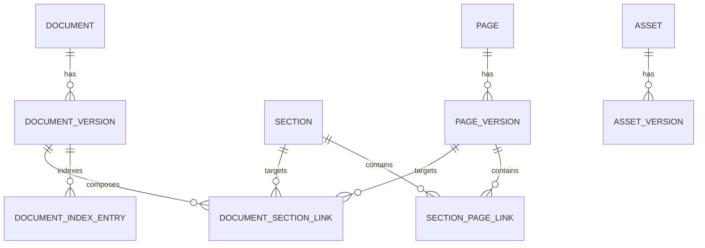

# Docman Model / DB Schema

## Overview

Docman uses a container/content split:

- `section` is a container
- `page-version` is content
- `document-section-link` builds the composed document tree
- `section-page-link` builds a flat reusable section page list
- `document-index-entry` stores persisted retrieval rows derived from one document version

## Entity Summary

### document

- `id`
- `documentUid`
- `groupId`
- `title`
- `titleMl`
- `summary`
- `summaryMl`
- `description`
- `descriptionMl`
- `status`
- `visibility`

### document-version

- `id`
- `documentId`
- `version`
- `status`
- `title`
- `summary`
- `releaseNotes`
- `releaseNotesMl`

### section

- `id`
- `sectionUid`
- `kind`
- `slug`
- `title`
- `titleMl`

### page

- `id`
- `pageUid`
- `kind`
- `title`
- `titleMl`

### page-version

- `id`
- `pageId`
- `version`
- `status`
- `format`
- `title`
- `content`
- `contentMl`
- `contentData`
- `directives`

Source-format notes:

- accepted values are `md`, `mdx`
- `page-version` owns source-format identity
- `page` stays format-agnostic
- current native compose/fetch path is `md` and `mdx`
- MDX module preambles are preserved during compose and hoisted ahead of composed headings/content

### asset

- `id`
- `assetUid`
- `kind`
- `title`
- `slug`
- `altText`
- `currentVersionId`
- `meta`

### asset-version

- `id`
- `assetId`
- `version`
- `label`
- `status`
- `storageKey`
- `sourcePath`
- `sourceUrl`
- `filename`
- `mime`
- `contentHash`
- `byteSize`
- `width`
- `height`
- `variants`
- `meta`

Asset compose notes:

- authored source should reference assets as `asset://<assetUid-or-slug>` or `asset://<assetUid-or-slug>@<version>`
- compose resolution uses logical asset identity plus `asset-version.sourceUrl`
- `storageKey` and `sourcePath` remain storage metadata and are not emitted into composed source text

### document-section-link

- `id`
- `documentVersionId`
- `kind`
- `sectionId`
- `pageVersionId`
- `parentLinkId`
- `position`
- `depth`
- `titleOverride`
- `titleVisible`
- `numbering`
- `pageBreakBefore`
- `pageBreakAfter`
- `directives`

Rules:

- `kind=section` uses `sectionId`
- `kind=page` uses `pageVersionId`
- sections may nest only under other sections
- pages may attach only under a section
- page under page is invalid

### section-page-link

- `id`
- `sectionId`
- `pageVersionId`
- `position`
- `numbering`
- `titleOverride`
- `titleVisible`
- `pageBreakBefore`
- `pageBreakAfter`

Rules:

- flat only
- unique ordering within `sectionId`
- no nested pages

### document-index-entry

- `id`
- `documentVersionId`
- `documentId`
- `locale`
- `fallbackLocale`
- `itemKind`
- `sortOrder`
- `buildFingerprint`
- `linkId`
- `parentLinkId`
- `anchor`
- `parentAnchor`
- `number`
- `depth`
- `position`
- `title`
- `breadcrumb`
- `titleVisible`
- `pageBreakBefore`
- `pageBreakAfter`
- `sectionId`
- `sectionUid`
- `sectionSlug`
- `pageId`
- `pageUid`
- `pageVersionId`
- `format`
- `pageNumberStart`
- `pageNumberEnd`
- `bodyText`
- `searchText`
- `summaryText`
- `sourceCharCount`
- `sourceWordCount`
- `summaryCharCount`
- `summaryWordCount`
- `embeddingProvider`
- `embeddingModel`
- `embeddingHash`
- `embeddingDimensions`
- `embeddingVector`

Retrieval notes:

- one `document-index-entry` row is the persisted owner for both lexical retrieval data and summary enrichment
- document summary can prefer authored document/document-version summary text
- section and page summaries remain deterministic derivations from persisted source text

Retrieval notes:

- rows are derived and rebuilt from composed document structure; they are not editable source records
- `itemKind` is currently `document`, `section`, or `page`
- anchors and breadcrumbs are persisted to support stable retrieval and follow-up expansion
- `bodyText` stores compact searchable body text for page-level retrieval
- `searchText` is the normalized lexical search surface used by deterministic search
- `embeddingProvider`, `embeddingModel`, `embeddingHash`, `embeddingDimensions`, and `embeddingVector` store the persisted semantic retrieval signal for hybrid/semantic reranking
- build freshness is tied to `buildFingerprint`

## Content Asset Direction

- `asset` is the durable logical owner for publish-grade resources such as images and attached files.
- `asset-version` stores content-addressed revisions, storage locators, mime/hash metadata, and derived-variant metadata.
- `embed` and `page-embed-link` continue to cover lightweight placement/render metadata.

## Relationship Map

